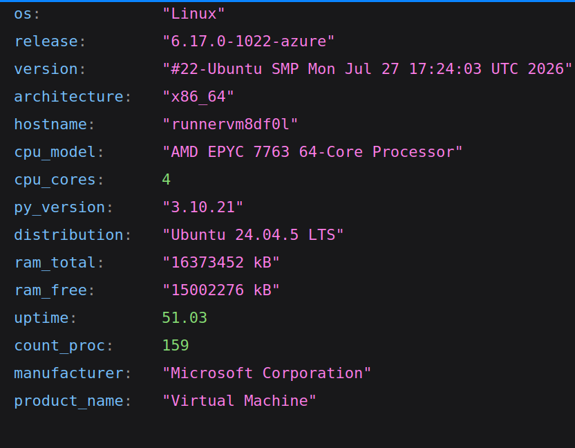
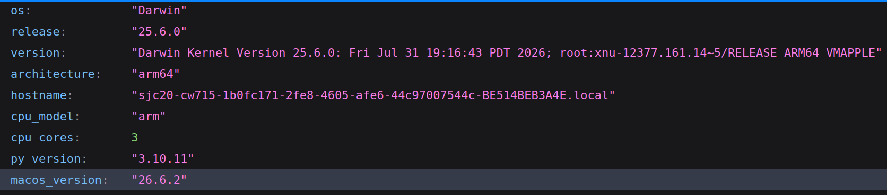
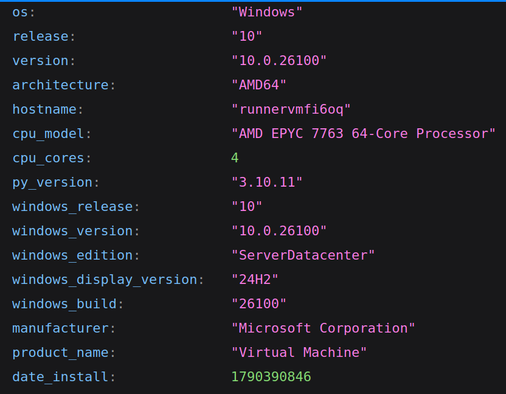

# Кроссплатформенный сбор информации об ОС

Программа собирает информацию о ос и сохраняет её в файл `sys_config.json`. 
### Был реализован ооп подход, для того чтобы его повторить и с целью дальнейшего расширения проекта.

## Описание работы

1. Программа определяет ос с помощью `platform.system()`.
2. Создаётся соответствующий объект: `LinuxOS`, `WindowsOS` или `MacOS`.
3. Родительский класс `OperatingSystem` собирает общую информацию: название ОС, версию, архитектуру, имя компьютера, версию Python и модель процессора.
4. Дочерний класс добавляет данные, характерные для конкретной системы.(Linux информация читается из файлов `/proc` и `/etc/os-release`)
5. Метод `collect()` объединяет общие и дополнительные данные в один словарь.
6. Словарь сохраняется в файл `sys_config.json` в формате JSON.
7. GitHub Actions запускает программу на Linux, Windows и macOS, чтобы проверить её работу на разных операционных системах.

## Собираемая информация

- название операционной системы;
- версию и release;
- архитектуру процессора;
- имя компьютера;
- версию Python;
- модель процессора;
- количество ядер и информацию о памяти в Linux;
- название дистрибутива Linux;
- время работы системы;
- версию Windows или macOS.

## GitHub Actions

Workflow автоматически запускает программу на трёх операционных системах:

- Ubuntu;
- Windows;
- macOS.

## Результаты выполнения

### Linux

### macOS

### Windows

